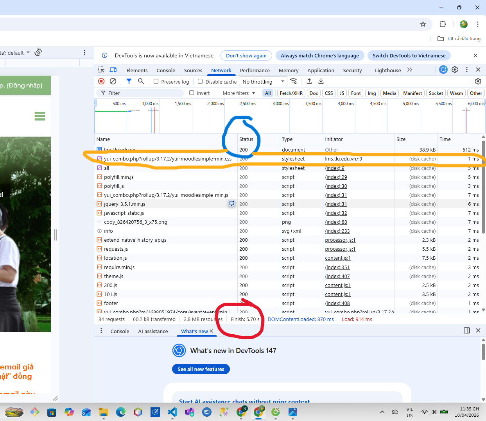
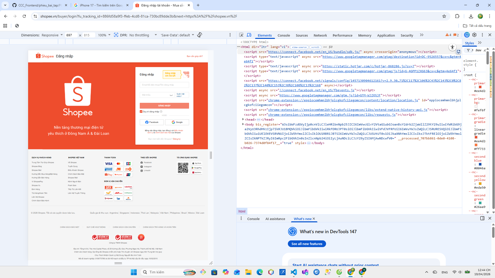
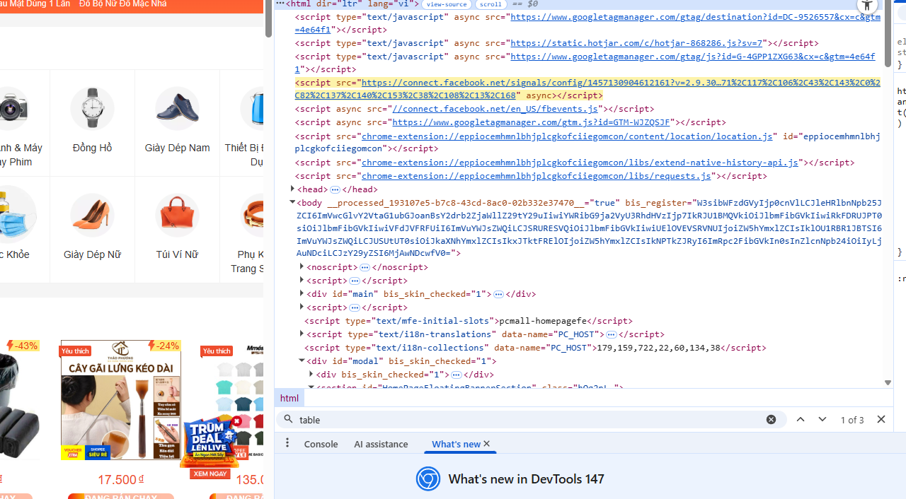
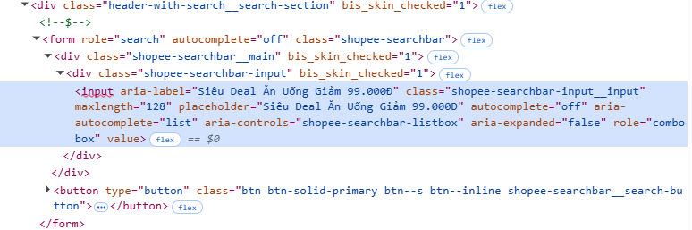

Nguồn: 01_introduction_html_universe.md

<!-- CÂU A1: -->
Các bước truy cập https://shoppe.vn:

Các bước:
1. DNS → tìm IP
2. Kết nối TCP + HTTPS
3. Gửi HTTP Request
4. Server xử lý
5. Trả về HTML
6. Tải CSS, JS
7. Render trang

Tab Network:
- Hiển thị tất cả request/response giữa trình duyệt và server
- Bao gồm: Status, Time, Type, Size, file tải (HTML, CSS, JS...)

Hình: Tab Network trong DevTools

- Status code của request đầu tiên: 200  
- Tổng thời gian tải: 5.70s  
- File CSS: yui_combo.php?...css (Type: stylesheet): stylesheet = file dùng để định dạng giao diện (màu sắc, font, layout)

<!-- CÂU A2: -->
Nguồn: chương 04 — Semantic HTML

Lỗi:
- Dùng div thay header, nav, main, footer
- Không có thẻ semantic(là thẻ giải thích rõ ràng nội dung mà chúng bao quanh)
- Ảnh thiếu alt   
- Không dùng heading (h1, h2)

Sửa:
<header>...</header>
<nav>...</nav>
<main>
  

    <h2>iPhone 16 Pro</h2>
    
25.990.000đ

    
  

</main>
<footer>...</footer>

<!-- CÂU A3: -->
Nguồn: chương 04 — Block vs Inline

Hiển thị:
Hộp 1
Text A Text B
Hộp 2
Text C Text D
Hộp 3

Giải thích:
- div: block → xuống dòng
- span, strong: inline → cùng dòng

<!-- CÂU A4: -->
Nguồn: chương 05 — Tables

Phân biệt:

- <thead>: phần đầu bảng → chứa tiêu đề các cột  
- <tbody>: phần thân → chứa dữ liệu chính  
- <tfoot>: phần cuối → thường để tổng hợp hoặc ghi chú  

→ Việc tách như vậy giúp trình duyệt và công cụ tìm kiếm hiểu rõ cấu trúc bảng

Không nên dùng table để làm layout:

1. Dùng sai mục đích  
   → table sinh ra để hiển thị dữ liệu, không phải để chia bố cục

2. Khó chỉnh sửa  
   → cấu trúc lồng nhau nhiều, nhìn rối và khó bảo trì

3. Không tối ưu SEO  
   → Google khó xác định nội dung chính của trang

4. Hiển thị kém trên mobile  
   → bảng không co giãn linh hoạt như flexbox hoặc grid

<!-- B3-Gỡ lỗi HTML -->

Lỗi 1: Dòng 1 — <!DOCTYPE> sai — sửa thành <!DOCTYPE html>

Lỗi 2: Dòng 3 — thiếu đóng thẻ title — thêm </title>

Lỗi 3: Dòng 4 — charset sai utf8 — sửa thành UTF-8

Lỗi 4: Dòng 7 — thẻ h1 không đóng đúng — sửa </h1>

Lỗi 5: Dòng 11 — thẻ <a> không đóng — thêm </a>

Lỗi 6: Dòng 18 — img thiếu dấu ngoặc kép — sửa src="iphone.jpg"

Lỗi 7: Dòng 20 — thẻ <b> đóng sai vị trí — đưa </b> vào trong 

Lỗi 8: Bảng không có thead/tbody — thêm vào cho đúng cấu trúc

Lỗi 9: Dùng <td> cho tiêu đề — sửa thành <th>

Lỗi 10: Có 2 thẻ <main> — sai ngữ nghĩa — đổi cái sau thành <aside>

Lỗi 11: Dòng cuối — thẻ 
 trong footer chưa đóng — thêm 

<!-- Bài 4---Phân tích trang web thật -->

1. Thẻ semantic HTML5

- <header>: nằm ở đầu trang, chứa logo và thanh tìm kiếm  
- <nav>: khu vực menu điều hướng danh mục  
- <footer>: phần cuối trang, chứa thông tin liên hệ  

2. Lỗi ngữ nghĩa

- Trang sử dụng nhiều 
 thay vì các thẻ semantic như <section>, <article>  
- Cấu trúc nội dung chưa rõ ràng, thiếu phân chia bằng thẻ semantic  

3. Bảng (table)

Không tìm thấy thẻ <table> trên trang.
Trang sử dụng 
 và CSS để hiển thị dữ liệu thay cho bảng.

  

4. Form (ô tìm kiếm)

- action: /search (hoặc giá trị bạn thấy)  
- method: GET  

Input sử dụng:
- type="text" (ô nhập tìm kiếm)  
- type="submit" (nút tìm kiếm)  

